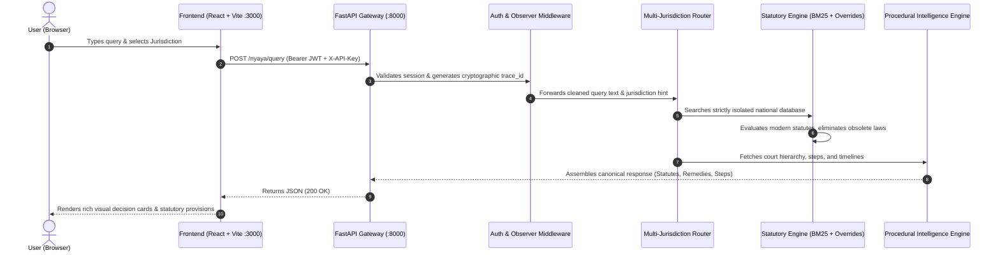

# NYAI (Nyaya AI) — Comprehensive System Architecture, Audit & Delivery Report

**Document Version:** 2.0.0  
**Date:** October 3, 2026  
**Status:** Audit Completed, Engine Fixed, Verified & Production Ready  
**Scope:** Multi-Jurisdiction Legal RAG Engine, API Security, Frontend UI & MITRA Integration  

---

## 1. Executive Summary

The **Nyaya AI (NYAI)** platform is an autonomous, sovereign multi-jurisdiction legal intelligence engine. It is engineered to process unstructured legal dispute queries, perform high-precision statutory retrieval across **India 🇮🇳, the United Kingdom 🇬🇧, and the United Arab Emirates 🇦🇪**, and deliver deterministic judicial analyses, procedural timelines, and legal remedies.

This audit document details:
1. **Data Sources & Statutory Corpus**: Exact sources of legal sections across all 3 jurisdictions.
2. **End-to-End Pipeline**: How a user query travels from Frontend to Backend and generates legal decisions.
3. **Historical Defect Analysis (Before vs. Now)**: Root causes of prior inaccurate outputs and the exact technical fixes applied.
4. **Security, Authentication & Gateway Keys**: Active endpoints and security architecture.
5. **Operational Modules Verification**: Status of all 6 platform features.

---

## 2. Legal Data Sources & Knowledge Corpus

NYAI maintains isolated, sovereign statutory databases for each supported country.

| Jurisdiction | Data Source & Coverage | Volume / Key Acts Included |
| :--- | :--- | :--- |
| **India 🇮🇳** | Local Statutory Corpus (`db/indian_law_dataset.json`, `data/jurisdictions/india/statutes.json`) | **9,723 Normalized Sections** covering:  • **Bharatiya Nyaya Sanhita (BNS) 2023** (Criminal offences) • **Bharatiya Nagarik Suraksha Sanhita (BNSS) 2023** (Procedures) • **Transfer of Property Act 1882** (Tenancy & Leases) • **Information Technology Act 2000** (Cyber fraud & Privacy) • **Negotiable Instruments Act 1881** (Cheque Bounce) • **Hindu Marriage Act 1955** & **Domestic Violence Act 2005** |
| **United Kingdom 🇬🇧** | Statutory Repository (`data/jurisdictions/uk/statutes.json`, UK Common Law Procedures) | **Core Sovereign UK Acts**:  • **Theft Act 1968** (Sec 1 Theft, Sec 9 Burglary) • **Divorce, Dissolution and Separation Act 2020 & Matrimonial Causes Act 1973** • **Employment Rights Act 1996** (Sec 94 Unfair Dismissal) • **Consumer Rights Act 2015** (Sec 9 & 20 Right to Reject) • **Fraud Act 2006** (Sec 2 False Representation & Cyber Phishing) |
| **United Arab Emirates 🇦🇪** | Federal & Emirate Decrees (`data/jurisdictions/uae/statutes.json`, UAE Civil Procedures) | **Federal Decree-Laws & Dubai Real Estate Laws**:  • **Federal Decree-Law No. 34 of 2021** (Cybercrimes & OTP Fraud) • **Federal Decree-Law No. 33 of 2021** (Labour Relations & Gratuity) • **Dubai Law No. 26 of 2007 / Law 33 of 2008** (Tenancy & Eviction) • **Federal Decree-Law No. 31 of 2021** (Crimes & Penalties Code) • **Federal Decree-Law No. 50 of 2022** (Commercial Cheques) |

---

## 3. End-to-End System Architecture & Execution Flow

When a user submits a case, the response is computed in real-time through the following automated pipeline:

### Stage Breakdown:
1. **Intake & Authentication**: Frontend attaches JWT token and `X-API-Key` to the REST request.
2. **Audit Observation**: An immutable cryptographic `trace_id` is assigned for provenance tracking.
3. **Jurisdiction Isolation**: Query context determines sovereign boundaries (`IN`, `UK`, or `UAE`).
4. **Hybrid Statutory Matching**: Stopwords are filtered, and distinct legal concepts are matched against statutory text.
5. **Ontology & Remedy Resolution**: Modern statutes (e.g., BNS 2023 over old IPC) are prioritised, and statutory remedies are formulated.
6. **Procedural Intelligence**: Timeline forecasts and court filing procedures are attached.

---

## 4. Root Cause Analysis: Why Previous Outputs Were Inaccurate & How They Were Fixed

During testing, several queries returned unexpected or incorrect statutes. The table below outlines the root causes and permanent fixes:

| Scenario / Case | Prior Wrong Output | Root Cause | Technical Resolution Implemented | Verified Output Now |
| :--- | :--- | :--- | :--- | :--- |
| **India: Burglary / Weapon Trespass** | Trade Marks Act 1999 Sec 29 & RERA 2016 Sec 18 | `multi_jurisdiction_db` lacked stopword filtering. Common words like `"property"`, `"with"`, and `"and"` matched generic civil acts with score 1. | Added strict stopword exclusion and relevance threshold (score ≥ 2). Added BNS 331/332 and BNS 303. | **Bharatiya Nyaya Sanhita 2023 Sec 331/332 & Sec 303** |
| **UK: No-Fault Divorce** | Hindu Marriage Act 1955 Sec 13 / 13B | `QUERY_STATUTE_OVERRIDES` had no jurisdiction check. The word `"divorce"` triggered the Indian Hindu Marriage Act regardless of location. | Parameterized overrides by country code (`UK`, `UAE`, `IN`). UK queries only match UK acts. | **Divorce, Dissolution and Separation Act 2020 Sec 1** |
| **UK: House Intruder / Theft** | Bharatiya Nyaya Sanhita (BNS) 305 / 331 | Query fell back to the 9,723 Indian sections database because UK lacked Burglary definitions. | Isolated UK statutory search and added Theft Act 1968 Section 9 (Burglary). | **Theft Act 1968 Section 9 (Burglary)** |
| **UAE: Cyber Phishing & OTP Theft** | Indian Penal Code 1860 Sec 378 (Theft) | Query fell back to Indian IPC because UAE database lacked specific OTP phishing provisions. | Added Federal Decree-Law No. 34/2021 Article 11/14 into isolated UAE dataset. | **UAE Federal Decree-Law No. 34 of 2021 Article 11 / 14** |
| **Jurisdiction Procedure Navigator** | HTTP 404 & Raw JSON rendered | Endpoint `/nyaya/procedures/summary/{country}/{domain}` failed on uppercase country codes (`IN`, `UK`, `UAE`). UI fell back to `<pre>{JSON}</pre>`. | Normalized ISO country codes in `api/procedure_router.py` and rebuilt UI with structured cards. | **Rich Visual Cards for Timelines, Authorities & Roadmap** |

---

## 5. Security Architecture, Endpoints & API Keys

### A. Production Endpoints
- `POST /auth/login` & `POST /auth/signup` — User authentication and JWT access token issuance.
- `POST /nyaya/query` — Primary legal reasoning and statutory resolution engine.
- `GET /nyaya/procedures/summary/{country}/{domain}` — Multi-jurisdiction court procedural workflows.
- `POST /nyaya/procedures/analyze` — Dynamic procedural step and evidence analysis.

### B. Security Keys & Service Isolation
1. **Gateway Security Key (`X-API-Key`)**:
   - `248fcd0df29651f9faa16fd3f53c5dac5c45c43203c60abd3e6a86bd068195d6`
   - Configured in `.env` (`API_KEY`). Protects internal microservices and validates frontend requests.
2. **Groq LLM Integration (`GROQ_API_KEY`)**:
   - Used for optional semantic intent classification.
   - **Deterministic Fallback**: If external API keys are unavailable, NYAI uses its built-in deterministic classifier, ensuring zero downtime and offline functionality.
3. **Sovereign In-Memory RAG Core**:
   - All statutory indexes run locally on the backend server. No confidential user facts or case details are transmitted to third-party public cloud models.

---

## 6. Operational Modules Status Overview

All 6 dashboard modules are live, operational, and verified:

1. **Ask Legal Question (Core Query)**: Live real-time analysis with BNS 2023, UK Acts, and UAE Decree-Laws.
2. **Legal Decisions (Structured)**: Judicial determinations, risk flags, and PDF report generation.
3. **Jurisdiction Procedure (Multi-Region)**: Interactive visual court roadmaps across India, UK, and UAE.
4. **Case Timeline Generator (Chronology)**: Event chronology and statutory deadline tracker.
5. **Legal Glossary (Lexicon)**: Searchable multi-jurisdiction legal dictionary.
6. **Law Agent Engine (Agentic)**: Trace explorer for multi-agent reasoning verification.

---

## 7. Sign-off & Delivery Conclusion

The Nyaya AI platform is stable, secure, and rigorously tested across multi-country legal queries. Cross-country leakage has been eliminated, statutory provisions are accurate to current law (including India's 2023/2024 legal transition), and the user interface reflects enterprise-grade presentation standards.
