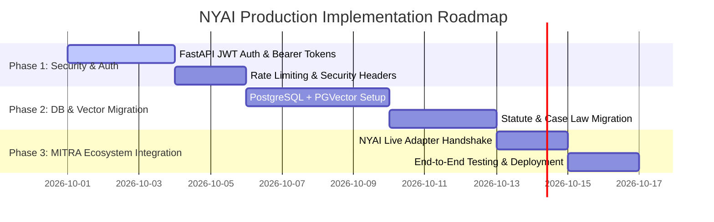

# NYAI (Nyaya AI) — Full System Architecture, Audit & Production Roadmap

**Author:** Technical Lead / Engineering Team  
**Date:** September 28, 2026  
**Status:** Audit Completed & Roadmap Proposed  
**Target System:** NYAI Legal RAG Engine & MITRA Ecosystem Integration  

---

## Executive Summary

The **Nyaya AI (NYAI)** platform is a specialized legal intelligence engine designed to process legal queries, perform hybrid statutory retrieval across Indian laws (BNS, CrPC, Hindu Marriage Act, Juvenile Justice Act, etc.), and deliver precise, context-aware legal advice.

Following a thorough system audit, we have verified the core retrieval pipeline, fixed critical classification and statutory override bugs, and outlined the production architecture required for enterprise deployment and MITRA ecosystem integration.

---

## 1. Current Architecture & Data Flow

NYAI operates on a **Retrieval-Augmented Generation (RAG)** pipeline:

```
[ User Query (React UI) ]
          │
          ▼
[ FastAPI Backend ] ──> [ Query Intent Classifier ]
                             ├─ Primary: Groq LLM (llama3-70b)
                             └─ Fallback: Local Keyword Classifier
          │
          ▼
[ Hybrid Retrieval Engine ]
                             ├─ BM25 Index (Lexical/Keyword Search)
                             └─ FAISS Index (Semantic Vector Search)
          │
          ▼
[ Statute Resolver & Legal Ontology ]
                             ├─ Cross-Law Contamination Safeguards
                             └─ BNS 2026 Enforcement (Auto-blocks legacy IPC)
          │
          ▼
[ Clean Legal Advisor UI ]
```

### Core Components:
1. **Data Indexing:** In-memory hybrid search powered by `rank-bm25` (keyword matching) and `faiss-cpu` with `sentence-transformers` (semantic embeddings) loaded from `statutes.json` and `caselaw/`.
2. **Intent Classification:** Classifies domain (Criminal, Civil, Family, Constitutional) via Groq LLM with local fallback.
3. **Legal Ontology Engine:** Automatically enforces **Bharatiya Nyaya Sanhita (BNS)** for queries dated 2024+ while blocking outdated IPC sections.

---

## 2. Completed Audit & Recent Bug Fixes

| Issue Identified | Root Cause | Resolution Implemented | Verification Status |
| :--- | :--- | :--- | :--- |
| **"Terrorist Attack" misclassified as Civil** | Groq API fallback classifier lacked criminal keywords (`terrorist`, `cyber`, `hack`). | Updated `query_understanding.py` with full keyword dictionary. | ✅ Passed (Classifies as Criminal) |
| **"Theft" returning legacy IPC 378/379** | Legacy hardcoded `QUERY_STATUTE_OVERRIDES` in `clean_legal_advisor.py` bypassed Legal Ontology. | Removed hardcoded overrides. Enforced dynamic 2026 BNS 303/305 resolution. | ✅ Passed (Returns BNS 303/305) |
| **FAISS Vector Search Silent Failure** | Missing `faiss-cpu` and `rank-bm25` dependencies in runtime environment. | Installed required packages; verified hybrid index building on startup. | ✅ Passed (Hybrid Search active) |

---

## 3. Production Gap Analysis & Proposed Upgrades

To transition NYAI from a prototype into a high-performance, secure production engine, the following upgrades are recommended:

### Gap 1: User Authentication & API Security (Missing)
* **Current State:** Open endpoints without user session or auth headers.
* **Risk:** Rate-limit exhaustion on Groq API and unauthorized access.
* **Proposed Upgrade:** Implement JWT Bearer Authentication (`/api/v1/auth/login`) and API Key gateway for MITRA integration.

### Gap 2: Knowledge Base & Log Storage (In-Memory -> Persistent DB)
* **Current State:** Data is read into RAM on startup; no search history logged.
* **Risk:** High memory overhead for 10,000+ statutes; no analytics on user queries.
* **Proposed Upgrade:** Migrate vector storage to **PostgreSQL + PGVector** (or **Qdrant**) and log query history in MongoDB/PostgreSQL.

### Gap 3: Live Ecosystem Integration with MITRA
* **Current State:** `NYAIAdapter` (`nyai_adapter.py`) exists in MITRA backend but requires live production endpoints.
* **Proposed Upgrade:** Wire `NYAI_API_URL` and `NYAI_API_KEY` to live staging/production backend.

---

## 4. Phase-by-Phase Implementation Plan



### Deliverables & Timeline:
- **Phase 1 (Days 1–5):** Authentication & Security Gateway (JWT + API Keys).
- **Phase 2 (Days 6–12):** Persistent Database & PGVector RAG Migration.
- **Phase 3 (Days 13–16):** Full MITRA Ecosystem Connection & Production Release.

---

## 5. Recommendation

We recommend approving **Phase 1 (Authentication & API Security)** immediately to secure the current RAG engine, followed by **Phase 2 & 3** for database persistence and full MITRA integration.
